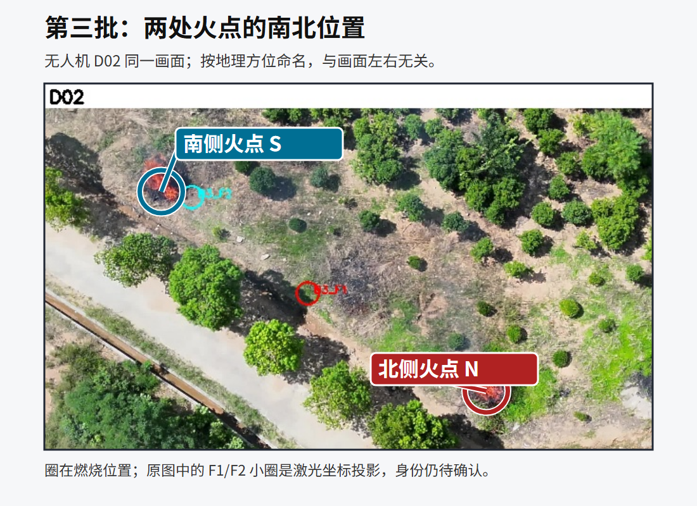
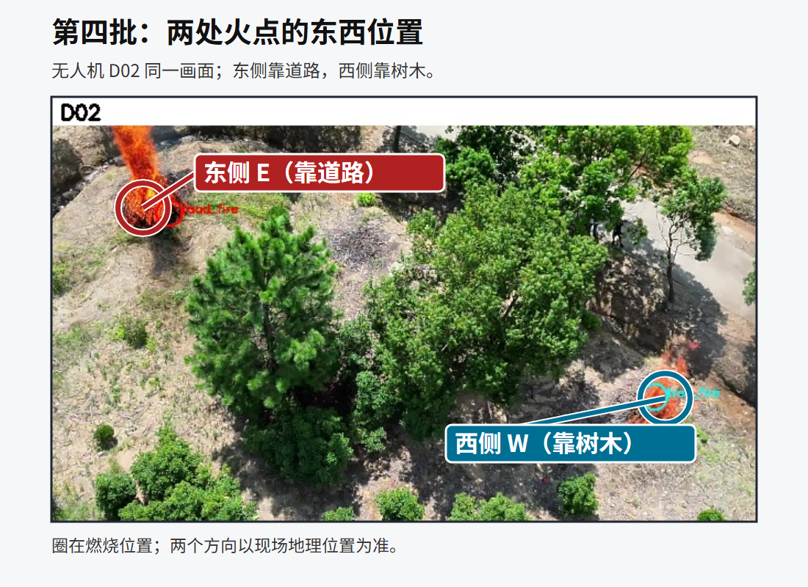

# 六处火点与现存激光原照：人工判断页

日期：2026-09-27。以下按四批六处**视频明火**排序。图上的红/青圈来自后续坐标投影或人工标注，**不是相机拍到的激光光斑**。每个激光事件的 V/T 是原始 JPG；保留了 EXIF/XMP。请主要依据火堆、道路、树木和视角关系判断物理对应。

## 1. B1 单火点（2026-09-07 16:03）

视频多视角画面和 B1 F1 坐标投影：

B1 F1 事后 16:40:24 激光原照：[可见光原图](激光原照/B1_F1_DJI_20260907164024_0001_V.JPG) · [同时刻热像原图](激光原照/B1_F1_DJI_20260907164024_0001_T.JPG)。原照中为靠沟渠的炭化枝柴堆。请判断它是否就是上面燃烧的同一堆。

## 2. B2 单火点（2026-09-08 09:25）

视频多视角画面和 B2 F1 坐标投影：

B2 F1 点火前 09:22:58 激光原照：[可见光原图](../_dji_preview/b4_identity_review/B2_prefire_092258_V.JPG) · [同时刻热像原图](激光原照/B2_F1_DJI_20260908092258_0002_T.JPG)。原照是未点燃的木柴堆。

另有 11:21:05 的“B4 F1”测距照片：[可见光原图](../_dji_preview/b4_identity_review/B4_F1_112105_V.JPG) · [同时刻热像原图](激光原照/B4_F1_DJI_20260908112105_0001_T.JPG)。先前已判断它与 B2 堆址同址；可在本页重新核对，**不要仅凭文件夹名归给第四批火点**。

## 3–4. B3 北侧与南侧明火（2026-09-08 10:07）

以下图中圈住的是**燃烧时的北、南两堆**。地理南北与画面左右无关。

[七视角原视频抽帧](../_dji_preview/b3_contact.jpg)和[旧 F1/F2 坐标投影图](../_dji_preview/B3_LRF_video_correspondence_confirmation.jpg)可辅助比对树、路、第三堆枝柴；旧图的文字是当时的待确认问题，不是最新身份结论。

**B3 F1，10:20:28 事后测距：**[可见光原图](../_dji_preview/DJI_20260908102028_0002_V.JPG) · [同时刻热像原图](激光原照/B3_F1_DJI_20260908102028_0002_T.JPG)。现有坐标处于两处视频明火之间，可能靠近第三堆枝柴。请判断它对应北侧燃烧堆、南侧燃烧堆、中间枝柴堆，还是不能判断。

**B3 F2，10:19:36 事后测距：**[可见光原图](../_dji_preview/DJI_20260908101936_0003_V.JPG)。当前将它作为南侧火点的候选参考；请独立判断。现存这一事件只有 V 原照，没有找到同一事件 T 原照。

## 5–6. B4 东侧靠道路与西侧靠树木明火（2026-09-08 10:54）

以下画面标出两处实际燃烧堆；目前**没有确认对应的独立激光原照**。

11:21:05 文件夹中的“B4 F1”原照见第 2 节。它的坐标与 B2 F1 相差约 1 m，而与本画面的两处影像估计点均相距约 78 m；除非有新的现场证据，不能把它分配给 B4 东侧或西侧。`B4 F2` 也没有唯一独立激光记录。

## 判断时请直接指出

1. B1 事后炭化堆是否与 B1 视频明火同址；
2. B2 点火前堆与 11:21 炭化区是否同址；
3. B3 F1、F2 各对应北侧、南侧、中间枝柴堆，或无法判断；
4. B4 的东、西火点是否有你记得但此页未展示的独立打点照片/文件。

核查原始输入与坐标来源见[六火点坐标与身份总表](../火点点位整理_20260927/四批六火点坐标与身份总表.md)。
